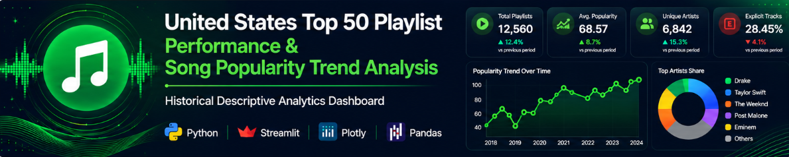
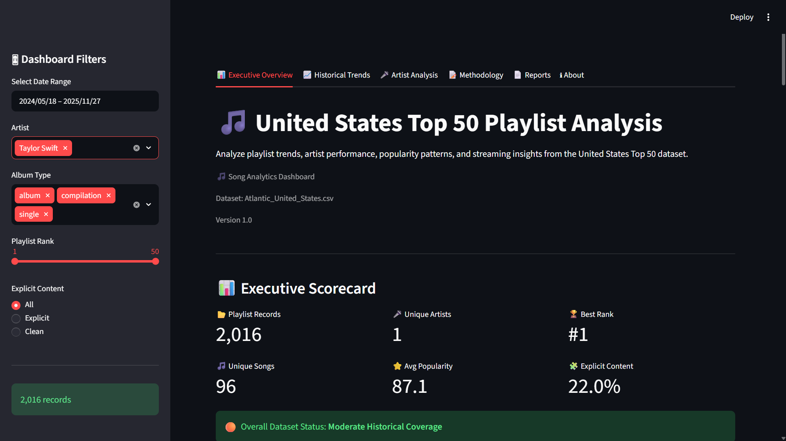
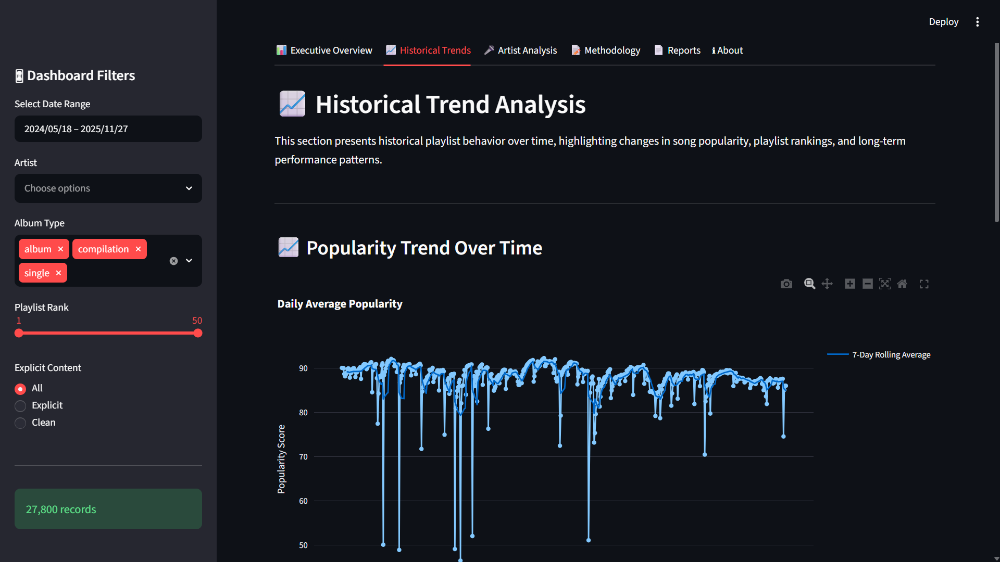
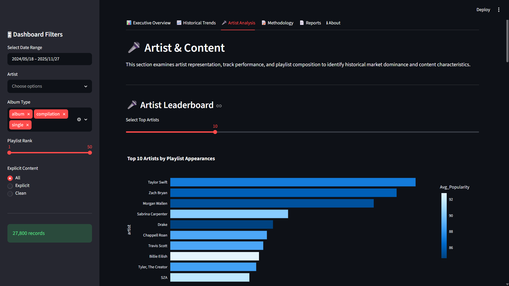
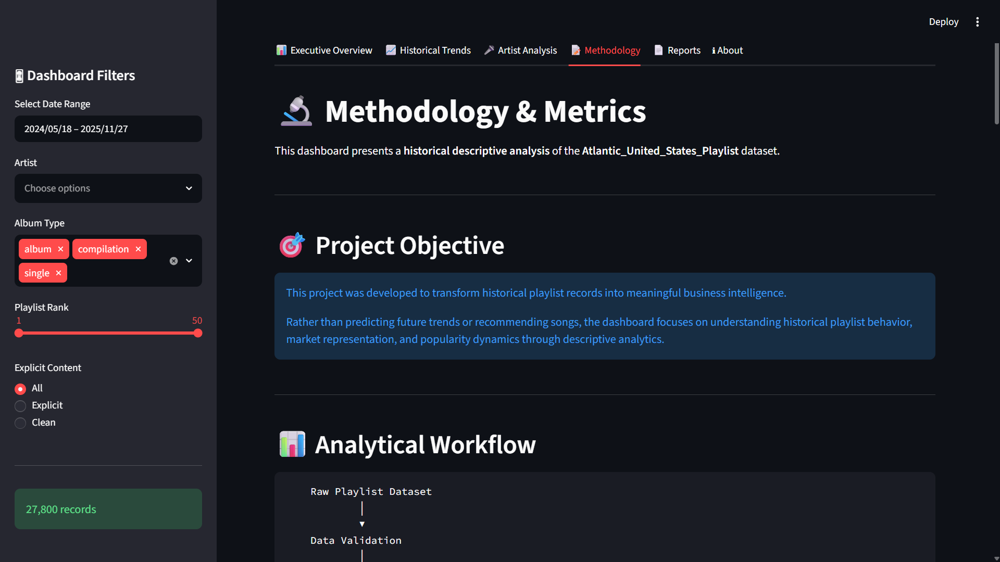
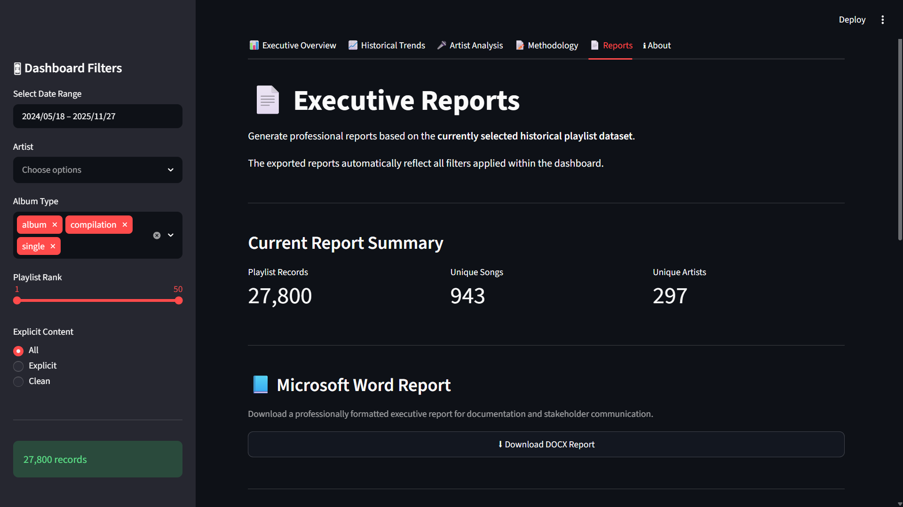
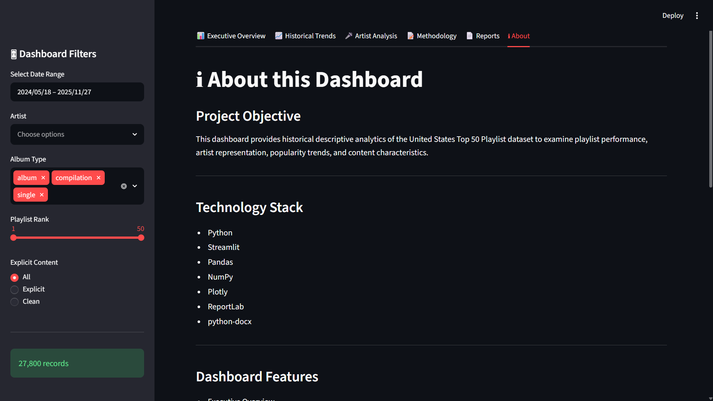

<p align="center">



</p>

<h1 align="center">

🎵 United States Top 50 Playlist Performance & Song Popularity Trend Analysis

</h1>

<p align="center">

🎵 Song Analytics Dashboard

</p>

> **An interactive historical analytics dashboard built with Streamlit to explore playlist performance, artist representation, song popularity trends, and executive reporting.**


---

## 📑 Table of Contents

- Project Overview
- Business Problem
- Objectives
- Dashboard Preview
- Features
- Architecture
- Installation
- Technology Stack
- Methodology
- Future Enhancements
- Author

# 📖 Project Overview

The 🎵 Song Analytics dashboard is an interactive Business Intelligence application developed using **Python** and **Streamlit**.

The project performs **historical descriptive analytics** on Atlantic_Records playlist data, enabling users to explore playlist performance, artist dominance, popularity trends, content characteristics, and executive business insights through an intuitive dashboard.

Unlike recommendation systems or predictive machine learning applications, this dashboard focuses on transforming historical playlist data into actionable business intelligence through interactive visualization and professional reporting.

---

# 🎯 Business Problem

Music streaming platforms generate large volumes of playlist data over time.

Understanding historical playlist performance requires more than spreadsheets and static reports. Analysts need interactive tools that allow them to explore playlist rankings, artist representation, popularity trends, and content characteristics dynamically.

This project addresses that challenge by providing an executive-level analytics dashboard designed for historical reporting and descriptive business analysis.

---

# 🎯 Project Objectives

- Analyze historical playlist rankings
- Evaluate song popularity trends
- Measure artist representation
- Examine explicit content distribution
- Generate executive business insights
- Produce downloadable executive reports
- Support historical decision-making through descriptive analytics

---

# 🚀 Project Highlights

✔ Modular Streamlit Architecture

✔ Interactive Business Dashboard

✔ Executive KPI Reporting

✔ Automated DOCX/PDF/CSV Reports

✔ Historical Playlist Analytics

✔ Professional UI Design

---

# 🖥 Dashboard Preview

| 📊 Executive Overview | 📈 Historical Trends |
|--------------------|-------------------|
|  |  |

| 🎤 Artist Analysis | 📝 Methodology |
|-----------------|---------|
|  |  |

| 📄 Reports Center | ℹ About |
|-----------------|---------|
|  |  |

---

# ✨ Dashboard Features

## 📊 Executive Overview

- Executive KPI Cards
- Executive Summary
- Business Insights
- Data Quality Assessment
- Executive Conclusion

---

## 📈 Historical Trends

- Playlist Ranking Trends
- Popularity Trend Analysis
- Historical Timeline
- Correlation Analysis

---

## 🎤 Artist Analysis

- Artist Leaderboard
- Top Songs Analysis
- Explicit Content Analysis
- Artist Representation

---

## 📝 Methodology

Documents the complete analytical workflow:

- Data Collection
- Data Preparation
- Descriptive Analytics
- Business Interpretation

---

## 📄 Executive Reports

Generate downloadable reports in multiple formats:

- 📘 Microsoft Word (.docx)
- 📕 PDF (.pdf)
- 📊 CSV (.csv)

Reports automatically reflect the currently selected dashboard filters.
---

# 🏗 Dashboard Architecture

```text
Atlantic_Records Playlist Dataset
          │
          ▼
Data Loading & Validation
          │
          ▼
Metrics Engine
          │
          ▼
Analytics Engine
          │
          ▼
Interactive Dashboard
          │
          ├── Executive Overview
          ├── Historical Trends
          ├── Artist Analysis
          ├── Methodology
          ├── Reports
          └── About
```

---

# 📂 Project Structure

```text
project/

│
├── app.py
│
├── assets/
│   ├── style.css
│   └── screenshots/
│
├── components/
│   ├── about.py
│   ├── conclusion.py
│   ├── dashboard_insights.py
│   ├── data_quality.py
│   ├── executive_summary.py
│   ├── explicit.py
│   ├── footer.py
│   ├── header.py
│   ├── kpis.py
│   ├── leaderboard.py
│   ├── methodology.py
│   ├── reports.py
│   ├── scatter.py
│   ├── scorecard.py
│   ├── sidebar.py
│   ├── timeline.py
│   └── top_songs.py
│
├── src/
│   ├── analytics_engine.py
│   ├── constants.py
│   ├── csv_export.py
│   ├── docx_export.py
│   ├── loader.py
│   ├── metrics.py
│   ├── pdf_export.py
│   ├── report_generator.py
│   └── utils.py
│
├── requirements.txt
└── README.md
```

---

# ⚙ Technology Stack & Tools

| Category | Technology |
|-----------|------------|
| Programming Language | Python |
| Dashboard Framework | Streamlit |
| Data Processing | Pandas, NumPy |
| Interactive Visualization | Plotly |
| Document Generation | python-docx |
| PDF Generation | ReportLab |
| Styling | HTML & CSS |

---

# 📂 Dataset Information

Dataset Name

Atlantic_United_States.csv

Source

Atlantic Recording Corporation Records

Analysis Type

Historical Descriptive Analytics

Records

(Automatically determined)

Primary Fields

• Artist

• Song

• Rank

• Popularity

• Explicit

• Date

---

# 🔬 Analytical Methodology

```text
Data Collection
        │
        ▼
Data Validation
        │
        ▼
Data Cleaning
        │
        ▼
Feature Engineering
        │
        ▼
Descriptive Analytics
        │
        ▼
Business Insights
        │
        ▼
Executive Reporting
```

---

# 🚀 Installation

Clone the repository

```bash
git clone https://github.com/yourusername/us-top50-playlist-analytics.git
```

Navigate to the project

```bash
cd us-top50-playlist-analytics
```

Install dependencies

```bash
pip install -r requirements.txt
```

Launch the dashboard

```bash
streamlit run app.py
```

---

# 📊 Dashboard Capabilities

- Executive KPI Dashboard
- Historical Playlist Analytics
- Artist Performance Analysis
- Popularity Trend Analysis
- Executive Business Insights
- Data Quality Assessment
- Executive Report Generation
- Interactive Filtering
- Responsive Streamlit Interface

---

# 📌 Release Information

Current Version

v1.0.0

Release

Executive Analytics Dashboard

Status

Stable Release

---

# 🔮 Future Enhancements

The current dashboard focuses exclusively on **historical descriptive analytics**.

Potential future improvements include:

- Spotify Web API Integration
- Machine Learning Models
- Playlist Popularity Forecasting
- Song Recommendation Engine
- Genre-Based Analytics
- Time-Series Forecasting
- User Authentication
- Cloud Database Integration
- Real-Time Dashboard Updates

---

# 🎓 Learning Outcomes

This project demonstrates practical experience in:

- Python Programming
- Data Cleaning & Preparation
- Exploratory Data Analysis (EDA)
- Business Intelligence Dashboard Development
- Interactive Data Visualization
- Report Automation
- Software Project Structuring
- Streamlit Application Development

---

# 👨‍💻 Author

## Kartikeya Mishra

Aspiring Data Analyst | Python Developer | Machine Learning Enthusiast

📧 Email: kartikmishra1225@gmail.com

GitHub: https://github.com/Mkarti

LinkedIn: www.linkedin.com/in/kartikeya-mishra-13krs03

---

# 📜 License

This project has been developed for educational, research, and portfolio purposes.

---

# 🙏 Acknowledgements

This project was built using the amazing open-source Python ecosystem, including:

- Python
- Streamlit
- Pandas
- NumPy
- Plotly
- ReportLab
- python-docx

Special thanks to the open-source community for providing the tools that made this project possible.

---

⭐ **If you found this project useful or interesting, consider giving the repository a star!**
